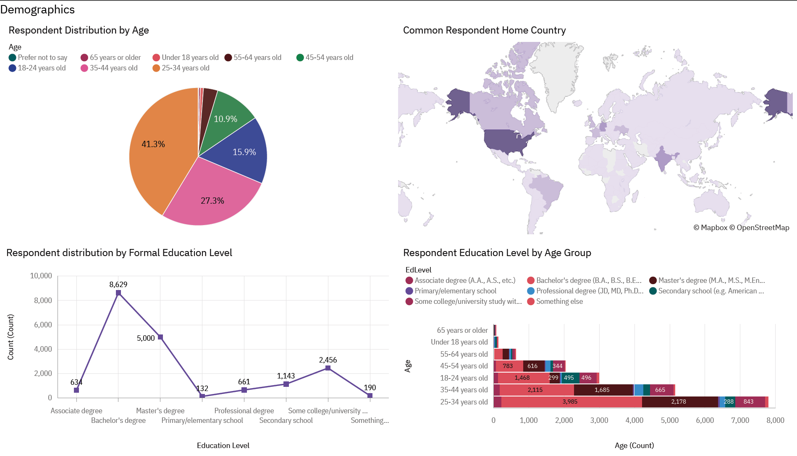

# Technology Trends & Developer Demographics Using Python and IBM Cognos

This project analyzes current and future technology trends alongside developer demographics using global survey data. It combines IBM Cognos dashboards with Python-based data cleaning and visualizations.

## Project Highlights

- **Languages**: JavaScript, SQL, and Python are consistently popular; Go and Rust are rising.
- **Databases**: PostgreSQL dominates, while Redis and Supabase are gaining traction.
- **Frameworks**: Node.js and React lead current usage; FastAPI and Vercel are gaining momentum.
- **AI Tools**: Younger developers (25–34) use AI heavily for debugging, coding, and research.
- **Job Market vs. Pay**: Legacy tools dominate job postings, but niche languages command higher salaries.

## Tools & Skills

- IBM Cognos (dashboards)
- Python (pandas, collections, seaborn)
- Jupyter Notebook
- Data wrangling and analysis
- Visualization and presentation

## Dashboard Preview

## Files

- [`Capstone Powerpoint.pdf`](Capstone%20Powerpoint.pdf): Final presentation slides
- [`Capstone_Final_Work.ipynb`](Capstone_Final_Work.ipynb): Full notebook with data cleaning and analysis
- [`Capstone Cognos Dashboards.pdf`](Capstone%20Cognos%20Dashboard.pdf): Imported Dashboards made on IBM Cognos

## Reflection

This project strengthened my ability to clean, analyze, and communicate insights from real-world data. I learned how to bridge technical analysis with business storytelling—skills I aim to apply in future analytics roles.
