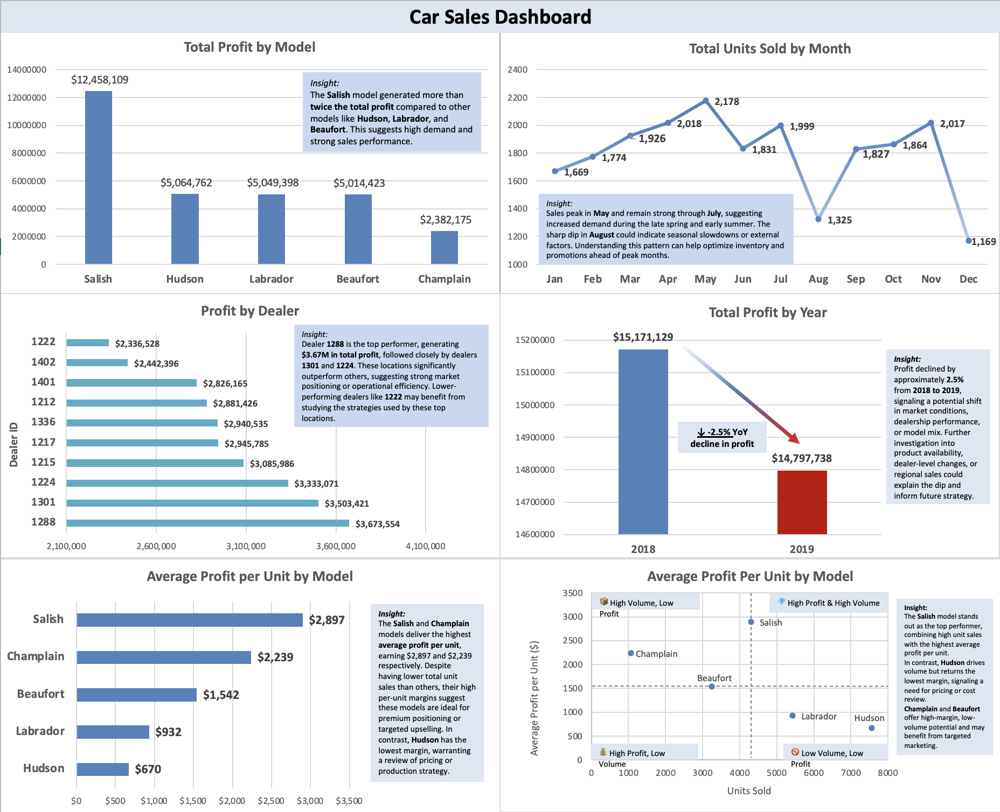

# 🚗 Car Sales Analysis Using Excel

This project analyzes dealership car sales data to identify performance trends in model sales, profitability, and efficiency. Built entirely in Microsoft Excel, the dashboard combines pivot tables, custom charts, and quadrant analysis to uncover actionable insights.

## 📊 What’s Included

- Profit by Model
- Units Sold by Month (Seasonality)
- Profit by Dealer
- Year-over-Year Profit Trends
- Average Profit per Unit by Model
- Custom Scatter Plot: Volume vs Profitability

## 🔍 Key Insights

- **Salish** was the strongest overall performer in both profit and volume.
- **Hudson** sold the most units but delivered the lowest profit per unit.
- **Champlain** and **Beaufort** offered high-margin opportunities with lower volume.
- **Profit dropped 2.5% from 2018 to 2019**, suggesting market or strategy changes.
- **May and November** were peak sales months, showing seasonal trends.

## 🛠 Tools Used

- Microsoft Excel
- Pivot Tables & Charts
- Manual quadrant overlays (scatter plot)
- Data storytelling & annotation

## 📸 Dashboard Preview

## 💡 Reflections

This project showcases how Excel can go far beyond basic spreadsheets to deliver real business intelligence. From visual storytelling to profitability analysis, this dashboard reflects my ability to extract insights and communicate them clearly.

