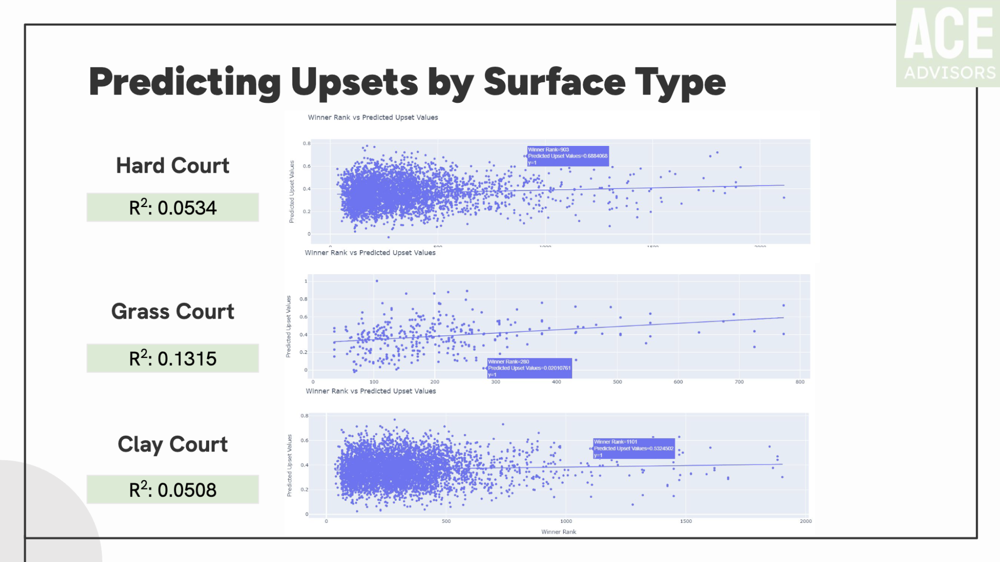
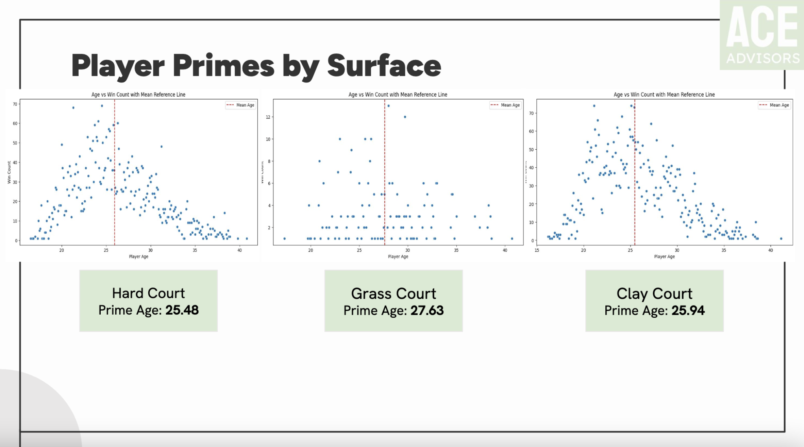
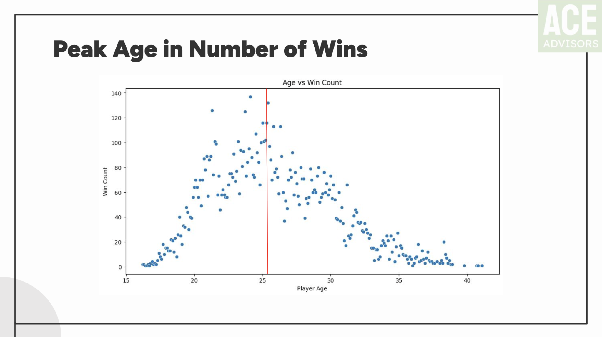
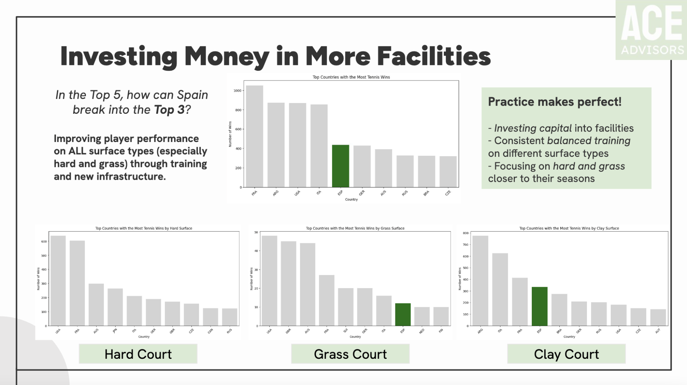

# Improving the ATP Tour • Sports Analytics with Python

This project explores match-level ATP Tour data to uncover surface-specific performance trends, player development strategies, and upset likelihoods. Using over 500,000 observations, we identify key areas for training investment and competitive improvement.

---

## Project Highlights

- **Peak Age & Surface**: Players peak at different ages depending on surface — clay vs. hard vs. grass.
- **Upset Prediction Models**: Trained models to assess how likely upsets are by surface.
- **Spanish Player Case Study**: Strategic recommendations for Spanish tennis development based on surface win rates and age profiles.

---

## Tools & Skills

- Python (pandas, scikit-learn, seaborn)
- Jupyter Notebook
- Exploratory data analysis
- Predictive modeling (classification)
- Data storytelling for sports strategy

---

## Key Visual
### Predicting Upsets by Surface Type

### Player Primes by Surface

### Peak Age in Number of Wins

### Investing in Facilities

---

## Files

- `report.pdf`: Full strategic report (includes visuals + recommendations)
- `figures/`: Visuals used in report and notebook
- - [`Improving ATP Tour`](Improving_the_ATP_Tour_–_Sports_Analytics_Project.pdf): Full Project PDF File download

---

## Reflection

This project helped me practice applying real-world data to strategic sports questions. I strengthened my skills in modeling, storytelling, and using analytics to inform athletic development — especially in niche contexts like surface specialization.
