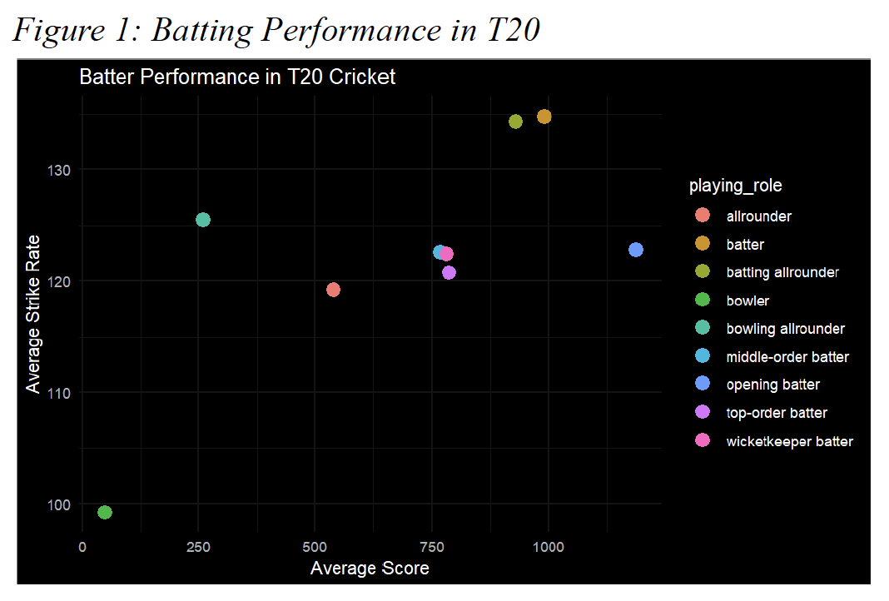
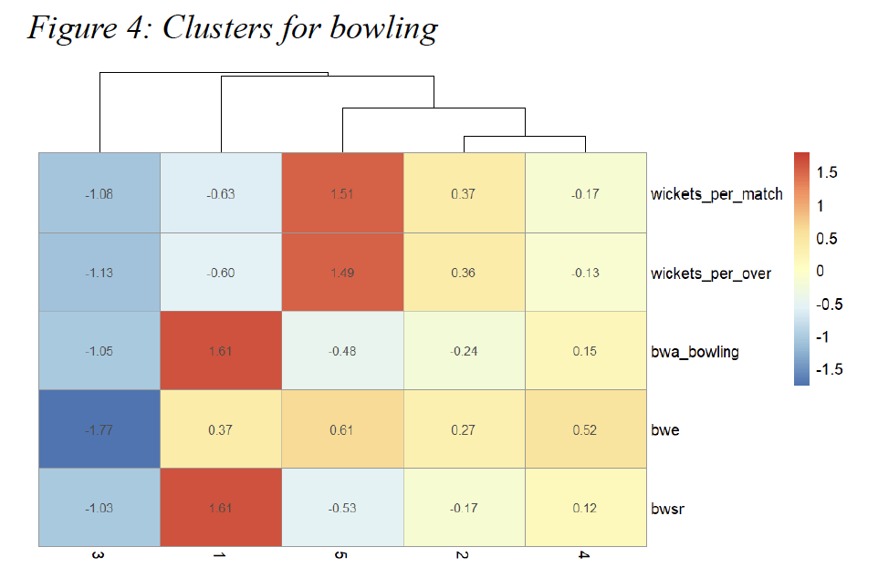
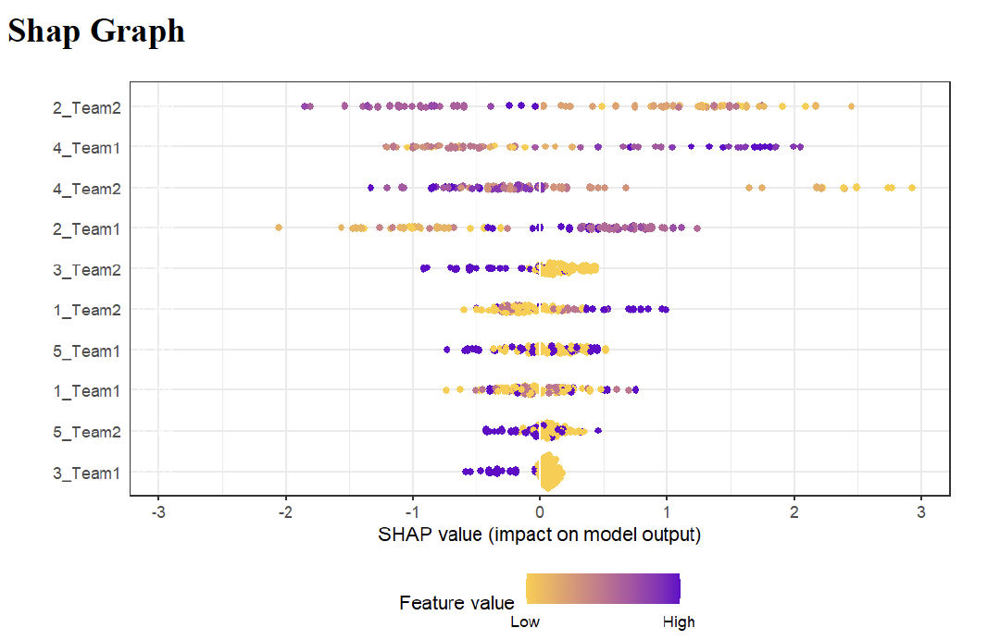
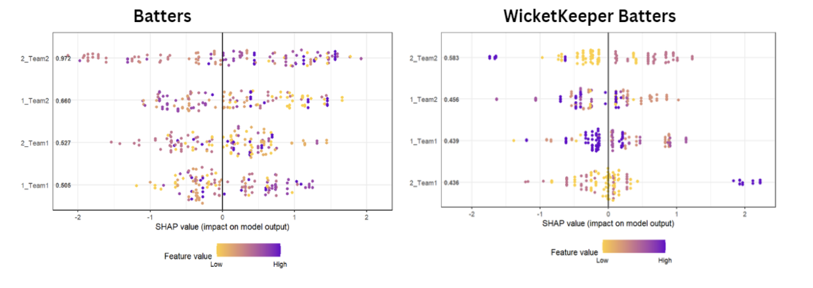

# Project 5 – T20 Cricket Player Index: Modeling Player Impact

**Tools Used:** Python (Jupyter Notebook), pandas, scikit-learn, XGBoost, SHAP

This project builds a custom player performance index for T20 cricket using data from five merged datasets. Players were clustered by role (batters, bowlers, wicketkeepers), and separate pipelines were used to model their impact on match outcomes. The project combines unsupervised and supervised learning with interpretable visuals to support data-informed strategy for player selection, team balance, and recruitment.

---

## Project Highlights

- **Role-Based Clustering**: Grouped players into performance-based clusters using K-Means.
- **Predictive Modeling**: Built XGBoost classifiers to predict match outcomes based on player features and clusters.
- **Model Interpretability with SHAP**: Used SHAP values to explain key factors driving match wins for each role type.
- **Strategic Insights**: Identified player types most associated with high-impact performances across batting and bowling roles.

---

## Tools & Skills

- Python (pandas, scikit-learn, XGBoost, SHAP)
- Feature engineering and clustering
- Supervised machine learning
- Role-based modeling
- Model interpretation and visualization
- Data storytelling for sports strategy

---

## Visual Insights
### [Project 5 – T20 Cricket Analytics: Performance, Clustering & SHAP Modeling](./project-5-cricket-analytics-t20)  
**Tools Used:** R (tidyverse, ggplot2, caret, cluster, SHAPforxgboost)  

Used T20 cricket data to identify key performance drivers, segment players using clustering, and interpret model predictions with SHAP values. Combined statistical analysis, machine learning, and rich visuals to deliver actionable insights for player evaluation and team strategy.

---

### Key Visuals

####   
**Average Score vs. Strike Rate across player roles**  
This scatter plot highlights how different player roles (e.g. top-order batter, allrounder) compare on batting metrics. Top-performing batters cluster in the top-right.

---

####   
**Wickets Taken vs. Economy Rate by Role**  
This visual compares bowlers and allrounders, showing how roles differ in balancing wicket-taking ability and economy. High-wicket bowlers tend to have lower economy rates.

---

####   
**Hierarchical Clustering on Bowling Stats**  
Cluster heatmap reveals distinct player groupings based on bowling performance metrics (e.g. wickets per over/match). Useful for role classification and scouting.

---

####   
**SHAP Value Summary: Key Drivers of Match Outcomes**  
Explains feature importance in model predictions for match outcomes. Higher SHAP values indicate stronger impact. Certain team-role combos had high predictive weight.

---

####   
**SHAP Value Breakdown by Batting & Wicketkeeper Roles**  
Role-based breakdowns show how different features influenced win prediction for specific player types. Useful for tactical role assignment.

---

### Files

- `report.pdf`: Full project report (EDA, clustering, modeling, insights)
- `notebook.Rmd`: Main RMarkdown analysis notebook
- `images/`: Visual assets for README and presentations

---

---

### SHAP Summary – Bowler Impact
Explained the most important features in the XGBoost model for predicting match outcomes.

---

### Cluster Performance – Batters
Analyzed win rates and average runs per cluster to assess batting impact.

---

### Strategic Summary
Key recommendations for team composition and recruitment based on role impact.

---

## 📁 Files Included

- `T20 Cricket Report.pdf`: Final report with visuals and strategic takeaways

---

## Reflection

This project deepened my understanding of how machine learning can drive decisions in sports management. I explored both performance profiling and outcome prediction, and practiced explaining technical models through visuals that support real-world decisions in team building and strategy.

